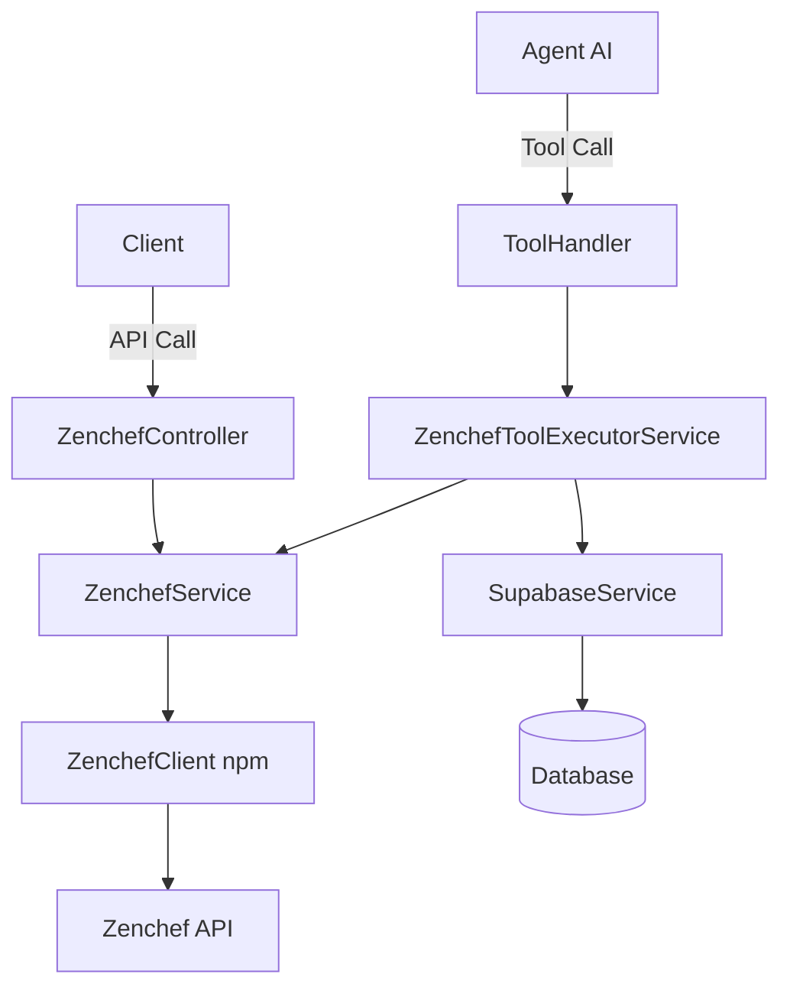

# Documentation Complète - Intégration API Zenchef

## Table des matières
1. [Vue d'ensemble](#vue-densemble)
2. [Architecture technique](#architecture-technique)
3. [Installation et configuration](#installation-et-configuration)
4. [Authentification](#authentification)
5. [API Endpoints](#api-endpoints)
6. [Intégration avec les agents AI](#intégration-avec-les-agents-ai)
7. [Types et interfaces](#types-et-interfaces)
8. [Gestion des erreurs](#gestion-des-erreurs)
9. [Tests et exemples](#tests-et-exemples)
10. [Conseils d'implémentation](#conseils-dimplémentation)

---

## Vue d'ensemble

L'intégration Zenchef est un système complet de réservation de restaurants qui permet aux agents AI (vocal, WhatsApp, Instagram) de gérer automatiquement les réservations clients via l'API Zenchef.

### Fonctionnalités principales
- ✅ **Vérification des disponibilités** : Consultation des créneaux libres avec capacité d'accueil
- ✅ **Création de réservations** : Booking automatique avec gestion intelligente des données manquantes
- ✅ **Informations restaurant** : Récupération des détails de l'établissement
- ✅ **Multi-plateforme** : Support WhatsApp, Instagram, appels vocaux
- ✅ **Auto-complétion intelligente** : Génération automatique des données client manquantes

### Points forts de l'implémentation
- 🔒 Authentification token-par-requête (pas de stockage de credentials)
- 🤖 Intégration native avec OpenAI Function Calling
- 📊 Logging détaillé avec emojis pour debug facile
- ⚡ Gestion des alternatives en cas d'indisponibilité
- 🌍 Support multi-langue (FR/EN)

---

## Architecture technique

### Structure modulaire (NestJS)

```
backend/src/modules/zenchef/
├── zenchef.module.ts                    # Module principal
├── zenchef.service.ts                   # Service wrapper pour l'API
├── zenchef-tool-executor.service.ts     # Exécuteur pour agents AI
├── zenchef.controller.ts                # Endpoints REST
├── types/
│   └── zenchef.types.ts                 # Interfaces TypeScript
└── dto/
    ├── get-availabilities.dto.ts        # DTO pour disponibilités
    └── book-table.dto.ts                # DTO pour réservations
```

### Dépendances

```json
{
  "zenchef-api": "file:libs/zenchef-api-1.0.2.tgz"
}
```

La bibliothèque `zenchef-api` est un package NPM local qui encapsule les appels à l'API Zenchef officielle.

### Flow de données



---

## Installation et configuration

### 1. Installation du package

```bash
# Le package est déjà dans le repo
npm install
```

### 2. Configuration de l'agent

La configuration se fait directement dans le champ JSONB `agent.zenChefConfig` :

```json
{
  "restaurantId": "359843",      // OBLIGATOIRE - ID du restaurant Zenchef
  "bookingUrl": "https://...",   // OPTIONNEL - URL de réservation
  "enabled": true                // OPTIONNEL - Activation explicite
}
```

### 3. Initialisation du service

```typescript
// Dans zenchef.service.ts
constructor() {
  // Pas de configuration nécessaire, utilise les defaults
  this.zenClient = new ZenchefClient();
  this.logger.log('✅ ZenchefClient initialized successfully');
}
```

### 4. Variables d'environnement

**Aucune variable d'environnement n'est requise** pour Zenchef. Le client s'initialise avec les valeurs par défaut.

---

## Authentification

### Système token-par-requête

L'API Zenchef utilise un système d'authentification unique où chaque réservation nécessite :

1. **Obtention du token** : Avant chaque réservation
```typescript
const tokenResponse = await this.zenClient.getAuthToken({
  restaurantId
});
// Retourne : { authToken: "xxx", timestamp: 1234567890 }
```

2. **Utilisation du token** : Pour la réservation
```typescript
const booking = await this.zenClient.booking(
  reservation,
  { restaurantId },
  {
    timestamp: tokenResponse.timestamp,
    authToken: tokenResponse.authToken,
  }
);
```

### Sécurité des endpoints

Les endpoints REST utilisent l'authentification Supabase JWT :

```typescript
@UseGuards(SupabaseAuthGuard)
@ApiBearerAuth('supabase-jwt')
```

---

## API Endpoints

### 1. Vérifier les disponibilités

**GET** `/api/zenchef/availabilities`

```typescript
// Paramètres query
{
  restaurantId: string;  // ID du restaurant
  dateBegin: string;     // Format: YYYY-MM-DD
  dateEnd: string;       // Format: YYYY-MM-DD
}

// Réponse
{
  success: true,
  data: [
    {
      date: "2025-11-15",
      bookable_from: "12:00",
      bookable_to: "22:00",
      isOpen: true,
      shifts: [
        {
          id: 1,
          name: "Service du soir",
          possible_guests: [2, 4, 6]
        }
      ]
    }
  ]
}
```

### 2. Créer une réservation

**POST** `/api/zenchef/booking`

```typescript
// Body
{
  restaurantId: "359843",
  day: "2025-11-15",
  time: "19:30",
  nb_guests: 4,
  firstname: "Jean",
  lastname: "Dupont",
  email: "jean.dupont@example.com",
  phone_number: "+33612345678",
  civility: "mr",  // "mr" ou "ms"
  lang: "fr",
  country: "FR",
  comment: "Anniversaire",
  customersheet: {
    // Mêmes données que ci-dessus
    firstname: "Jean",
    lastname: "Dupont",
    civility: "mr",
    phone: "+33612345678",
    email: "jean.dupont@example.com",
    optins: [{ type: "email", value: 1 }],
    country: "FR",
    lang: "fr"
  }
}

// Réponse
{
  success: true,
  message: "Réservation créée avec succès",
  data: {
    bookingId: "ZEN-123456",
    confirmationNumber: "CONF-789",
    status: "confirmed"
  }
}
```

### 3. Informations du restaurant

**GET** `/api/zenchef/restaurant/:restaurantId`

```typescript
// Réponse
{
  success: true,
  data: {
    id: "359843",
    name: "Le Gourmet Parisien",
    address: "123 Rue de la Paix, Paris",
    phone: "+33123456789",
    email: "contact@restaurant.com"
  }
}
```

### 4. Endpoints de test (sans auth)

Pour tester rapidement sans JWT :

```bash
# Test de réservation manuelle
curl -X POST https://backend-url/api/zenchef/test/booking \
  -H "Content-Type: application/json" \
  -d '{
    "restaurantId": "359843",
    "day": "2025-11-15",
    "time": "19:00",
    "nb_guests": 2,
    "firstname": "Test",
    "lastname": "Lumiron",
    "email": "test@lumiron.ai",
    "phone_number": "+33612345678",
    "civility": "mr"
  }'

# Test de réservation automatique (trouve le premier créneau disponible)
curl -X POST https://backend-url/api/zenchef/test/booking-auto \
  -H "Content-Type: application/json" \
  -d '{
    "restaurantId": "359843",
    "nb_guests": 2,
    "firstname": "Test",
    "lastname": "Lumiron",
    "email": "test@lumiron.ai",
    "phone_number": "+33612345678",
    "civility": "mr"
  }'
```

---

## Intégration avec les agents AI

### Tools OpenAI Function Calling

L'intégration définit 3 tools pour les agents AI :

#### 1. zenchef_check_availability
```json
{
  "name": "zenchef_check_availability",
  "description": "Vérifier les disponibilités du restaurant",
  "parameters": {
    "dateBegin": "2025-11-10",
    "dateEnd": "2025-11-17"
  }
}
```

#### 2. zenchef_create_reservation
```json
{
  "name": "zenchef_create_reservation",
  "description": "Créer une réservation",
  "parameters": {
    "day": "2025-11-15",
    "time": "19:30",
    "nb_guests": 2,
    "firstname": "Marie",
    "lastname": "Martin",  // Auto-généré si absent: "Lumiron"
    "email": "...",         // Auto-généré si absent
    "phone_number": "...",  // Auto-récupéré depuis WhatsApp si possible
    "civility": "ms",       // Auto-déduit du prénom
    "comment": "..."
  }
}
```

#### 3. zenchef_get_restaurant_info
```json
{
  "name": "zenchef_get_restaurant_info",
  "description": "Obtenir les informations du restaurant",
  "parameters": {}  // Pas de paramètres requis
}
```

### Auto-complétion intelligente

Le service `ZenchefToolExecutorService` gère automatiquement :

1. **Lastname manquant** : Toujours "Lumiron"
2. **Civilité** : Déduite du prénom avec patterns FR
3. **Email** : Généré avec timestamp si absent
4. **Téléphone** : Récupéré depuis WhatsApp si disponible
5. **Alternatives** : Propose ±30min et ±1h si créneau indisponible

### Routage des tools

```typescript
// Dans tool.handler.ts
switch (context.name) {
  case 'zenchef_check_availability':
  case 'zenchef_create_reservation':
  case 'zenchef_get_restaurant_info':
    result = await this.handleZenchefTool(context.name, args, context.state);
    break;
}
```

### Synchronisation automatique

Les tools Zenchef sont activés automatiquement quand :

```typescript
if (
  (agent.zenChefConfig?.enabled === true) ||
  (agent.zenChefConfig?.restaurantId) ||  // Activation implicite
  hasZenchefInIntegrations
)
```

---

## Types et interfaces

### ZenchefAvailability
```typescript
export interface ZenchefAvailability {
  date: string;
  bookable_from: string;
  bookable_to: string;
  isOpen: boolean;
  shifts: Array<{
    id: number;
    name: string;
    possible_guests: number[];
  }>;
}
```

### ZenchefReservation
```typescript
export interface ZenchefReservation {
  day: string;
  nb_guests: number;
  time: string;
  lang: string;
  firstname: string;
  lastname: string;
  civility: string;
  country: string;
  phone_number: string;
  email: string;
  comment?: string;
  customersheet: {
    firstname: string;
    lastname: string;
    civility: string;
    phone: string;
    email: string;
    optins: Array<{
      type: string;
      value: number;
    }>;
    country: string;
    lang: string;
  };
  // NE PAS inclure 'type' - cause des erreurs de validation
}
```

---

## Gestion des erreurs

### Erreurs courantes et solutions

#### 1. "No place for this booking"
Le service propose automatiquement des alternatives :
```typescript
// Recherche automatique d'alternatives
const alternatives = this.generateAlternativeTimes(
  time,
  shiftStart,
  shiftEnd
);
// Propose : ±30min, ±1h dans le même service
```

#### 2. Restaurant fermé
```json
{
  "success": false,
  "error": "restaurant_closed",
  "message": "Le restaurant est fermé le 2025-11-15. Proposez une autre date au client."
}
```

#### 3. Données manquantes critiques
```json
{
  "success": false,
  "error": "Missing phone_number: required for reservation (ask the client for their phone number)"
}
```

### Logging détaillé

Tous les services utilisent un logging emoji-based :
- 📅 Récupération disponibilités
- 🍽️ Création réservation
- ✅ Succès
- ❌ Erreur
- 🔑 Token obtenu
- ℹ️ Information restaurant

---

## Tests et exemples

### Scripts de test disponibles

```bash
# Test de l'intégration Zenchef
npm run test:zenchef

# Test d'une réservation
npm run test:zenchef:booking

# Test booking complet
npm run test:zenchef:book
```

### Exemple de conversation AI

```
Client: "Je voudrais réserver une table pour demain soir"
AI: [Utilise zenchef_check_availability]
AI: "J'ai des disponibilités demain. Combien de personnes ?"
Client: "Nous serons 4, vers 19h30"
AI: [Utilise zenchef_create_reservation]
AI: "Parfait ! À quel nom dois-je faire la réservation ?"
Client: "Marie"
AI: [Auto-complète avec lastname="Lumiron", déduit civility="ms"]
AI: "Votre réservation est confirmée pour 4 personnes demain à 19h30"
```

### Payload WhatsApp avec auto-complétion

```typescript
// Context WhatsApp
{
  platform: "whatsapp",
  fromNumber: "+33612345678"  // Auto-utilisé pour phone_number
}

// L'agent n'a besoin que de :
{
  day: "2025-11-15",
  time: "19:30",
  nb_guests: 2,
  firstname: "Marie"
}
// Tout le reste est auto-généré
```

---

## Conseils d'implémentation

### Pour un nouveau projet

1. **Installer le package NPM**
```bash
npm install zenchef-api
# ou utiliser le .tgz fourni
```

2. **Créer un service wrapper**
```typescript
@Injectable()
export class ZenchefService {
  private zenClient: ZenchefClient;

  constructor() {
    this.zenClient = new ZenchefClient();
  }

  async getAvailabilities(restaurantId, dateBegin, dateEnd) {
    return this.zenClient.getAvailabilities({
      restaurantId,
      dateBegin,
      dateEnd,
    });
  }

  async bookTable(restaurantId, reservation) {
    // 1. Obtenir token
    const { authToken, timestamp } = await this.zenClient.getAuthToken({
      restaurantId
    });

    // 2. Créer réservation
    return this.zenClient.booking(
      reservation,
      { restaurantId },
      { timestamp, authToken }
    );
  }
}
```

3. **Gérer les données manquantes**
- Toujours avoir des valeurs par défaut
- Déduire intelligemment (civilité depuis prénom)
- Générer les emails temporaires si besoin

4. **Implémenter la gestion d'alternatives**
```typescript
if (error.message.includes('No place')) {
  // Chercher les disponibilités du jour
  const availabilities = await getAvailabilities(restaurantId, day, day);
  // Proposer des créneaux alternatifs
  const alternatives = generateAlternatives(time, shift);
  return { alternatives };
}
```

### Points d'attention

⚠️ **NE PAS inclure le champ 'type'** dans les réservations (cause des erreurs)

⚠️ **Format téléphone** : Toujours normaliser en international (+33...)

⚠️ **Civilité** : Utiliser "mr" ou "ms" (pas "M." ou "Mme")

⚠️ **Dates** : Format strict YYYY-MM-DD

⚠️ **Heures** : Format strict HH:MM

### Optimisations recommandées

1. **Cache des disponibilités** : 5-10 minutes
2. **Rate limiting** : Max 10 req/sec par restaurant
3. **Retry avec backoff** : En cas d'erreur réseau
4. **Validation stricte** : DTOs avec class-validator
5. **Monitoring** : Tracker les réservations échouées

### Sécurité

- ✅ Pas de stockage de credentials en DB
- ✅ Token temporaire par transaction
- ✅ Validation stricte des inputs
- ✅ Sanitization des données client
- ✅ Logs sans données sensibles

---

## Migration base de données

```sql
-- Les 3 tools Zenchef
INSERT INTO tools (id, name, description, type, is_active, config_options)
VALUES
('zenchef_check_availability', ...),
('zenchef_create_reservation', ...),
('zenchef_get_restaurant_info', ...);

-- Configuration agent (JSONB)
UPDATE agent
SET zenChefConfig = '{"restaurantId": "359843", "enabled": true}'::jsonb
WHERE id = 'agent-id';
```

---

## Support et debugging

### Logs à surveiller
```bash
# Backend logs
heroku logs --tail --app lumiron-backend-prod

# Chercher les patterns
grep "🍽️" # Réservations
grep "📅" # Disponibilités
grep "❌" # Erreurs
```

### Endpoints de santé
```bash
# Vérifier les disponibilités
curl "https://backend/api/zenchef/test/availabilities?restaurantId=359843&dateBegin=2025-11-15&dateEnd=2025-11-20"

# Test de booking auto
curl -X POST "https://backend/api/zenchef/test/booking-auto" -H "Content-Type: application/json" -d '{"restaurantId":"359843","nb_guests":2,"firstname":"Test","lastname":"API","email":"test@api.com","phone_number":"+33612345678","civility":"mr"}'
```

---

## Conclusion

L'intégration Zenchef est **production-ready** avec :
- ✅ Gestion complète du cycle de réservation
- ✅ Intelligence artificielle intégrée
- ✅ Multi-plateforme (Voice, WhatsApp, Instagram)
- ✅ Auto-complétion intelligente
- ✅ Gestion des erreurs robuste
- ✅ Logging détaillé pour debug
- ✅ Tests automatisés

Pour toute question technique, référez-vous au code source dans `/backend/src/modules/zenchef/`.